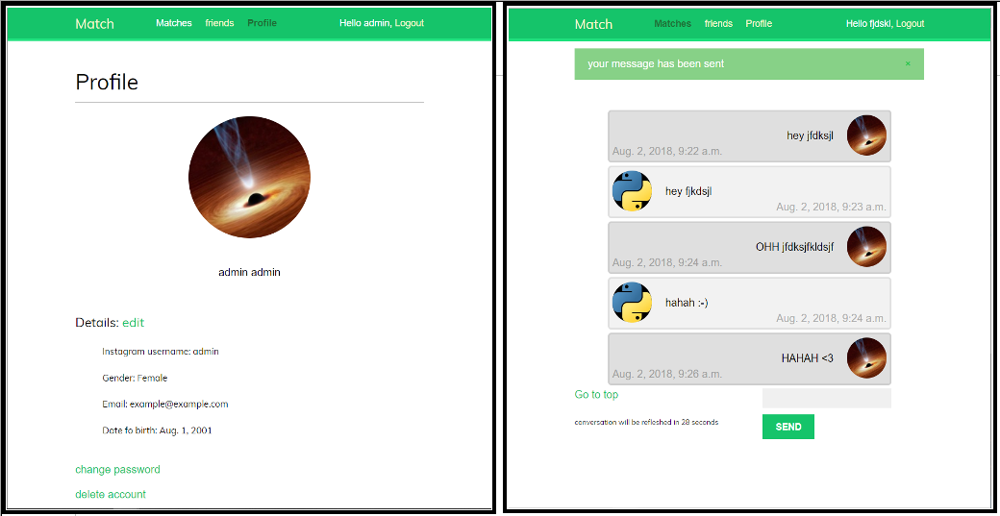

Its virus effect makes it ideal to touch a big public.

Probleme to solve 
------------------

people are afraid to ask someone out by fear of rejection. Which is a valid concern because let's say that everyone likes 1/30 person,
that makes the odds of her accepting 1/30(big maths here)! So you will have to swallow your dignitiy 30 times in average before you 
get to go on a single date! You must feel somewhat depressed now, but I have a solution for you! What if you could know if the person
likes you, while staying totally anonymous !   

Solution
----------------------

1. sign up for the website
1. enter the instagram username of the person you like (lets say it is a girl)
1. then the site will send an instagram Direct Message telling her to come on our website and enter the usernames of the guys she likes.
1. if she entered your username  
    &nbsp;&nbsp;&nbsp;&nbsp;&nbsp;&nbsp;there is a match and a conversation opens between you two(named chat in the code)  
    else  
    &nbsp;&nbsp;&nbsp;&nbsp;&nbsp;&nbsp;you continue your life like nothing happend
1. Virus effect the boys that she entered the username will also get a instagram DM, which makes it spread like wildfire !

Benefit
---------
    you can know query people like they where open databases! #gamechanger

Details
-------

I don't host this project because I have other projects to give my time to. So it would make me very happy if someone would like improve it and 
make a bit of marketing for it. So that many people can have access to this service. 

Feel free to take the code or the general idea if you prefer another programming language, I would love to see it available to everyone !

boring details
- look the requirements.txt file for the dependencies.
- it contains 
    - a user to user messaging system, but not an asyc one.
    - a loginlogoutregisterchange-passwordpassword-reset system.
    - a profileedit system.
    - an add friendmatching system
    - usernameemail authentication
- I didn't include the instagram DM bot in this code, because its too big of a setup to explain. You will be better off creating your own one.
I used selenium and a firefox webdriver.To send DM you than create a bot on a site like Postgrain(manages your instagram account).Good start [here](httpswww.youtube.comwatchv=BGU2X5lrz9M) 
- the css is not excellent.
- Note that if you wish to expand this project, like a lot of others, you will have to deal with the privacy regulations(GDPR).
- this project is easily scalable
- my target public would be teenagers between 13 and 18 for 4 reasons
    - it is pretty much an untapped market.
    - this age group uses instagram the most.
    - this service in this age group can be valuable because a [recent study](httpswww.ons.gov.ukpeoplepopulationandcommunitywellbeingarticleslonelinesswhatcharacteristicsandcircumstancesareassociatedwithfeelinglonely2018-04-10)
reveiled that they feel the most lonely.
    - legal reasons(maybe)

h3further informationh3

If you require any further information, let me know MathisP_public@outlook.com

